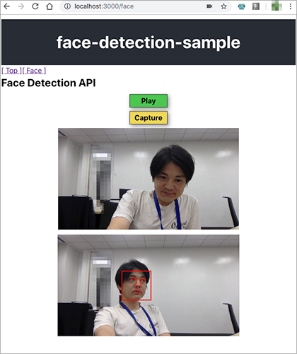
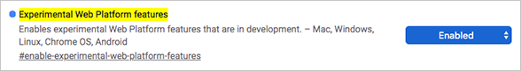
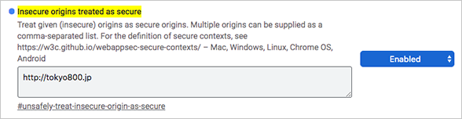

# face-detection-sample

Playing with Face Detection API **(+ React Hooks!!!)**

[1. About](#about)  
[2. Usage](#usage)  
[3. What I Did](#what-i-did)  
[4. Available Scripts](#avail)  
[5. Notes](#notes)  
[6. LICENSE](#license)  



[View Demo](http://tokyo800.jp/minagawah/face-detection-sample/)  
***In order to view the demo, you need to enable some of the Chrome's developer features.  
See the instructions in ["2. Usage"](#usage) for how.***


<a id="about"></a>
## 1. About

Playing with [Face Detection API](https://www.chromestatus.com/feature/4757990523535360).  
While it's still in a development stage for Chrome browser,  
for a front-end developer, doesn't it excite you at all?

Also, this is an attempt to use
[React Hooks](https://reactjs.org/docs/hooks-intro.html)
(or what provided in [streamich/react-use](https://github.com/streamich/react-use)).  
As a fanatic React lover, what has always been troubling me  
***was the way React states in my projects  
always turn out showing chaotic tendencies  
when it comes to managing actual files in the projects.***  
When the idea of
[ducks](https://github.com/erikras/ducks-modular-redux)
came out,  
I thought it really was a life saver!

At that time, I was also trying the right way
for applying FP practices to React projects.  
For [redux-observable](https://github.com/redux-observable/redux-observable)
was one of the choices, but I thought it rather complicates the code structure  
(I knew it from using
[RxJS](https://github.com/ReactiveX/rxjs) and
[MobX](https://github.com/mobxjs/mobx)
which made me realize `Observe` isn't the right way  
because you could easily forget where you set pub/sub in your project).  
[recompose](https://github.com/acdlite/recompose)
was another decent idea, and I was mainly using this for most of my React projects.

Then, [proppy](https://github.com/fahad19/proppy) came out (early last year).  
That was when I realized the nightmere has ended.  
No Redux no more!

**Then, came [React Hooks!!!!!!!](https://reactjs.org/docs/hooks-intro.html)**  
I mean, think about it.  
You have no idea how long I've waited
for major front-end frameworks to support FP in production,  
and at the same time simplifying the code sctuctures.  
I am so glad that I was born into this age....


<a id="usage"></a>
## 2. Usage

First of all, you need to enable Chrome's experimental features, so that Face Detection API would work.  
Type the following on Chrome browser's URL:

```
chrome://flags/#enable-experimental-web-platform-features
```

Switch it to `Enabled`:



Secondly, while this is optional,
and is **only required [to view my demo](http://tokyo800.jp/minagawah/face-detection-sample/).  
In order for `navigator.mediaDevices` to work without `https`,
you need to tell Chrome browser to ignore the security policy:

```
chrome://flags/#unsafely-treat-insecure-origin-as-secure
```

In the example bellow, you need to add `http://tokyo800.jp`.  
Add it.



When all is done, relaunch your Chrome browser, and you should be able to see the
[demo](http://tokyo800.jp/minagawah/face-detection-sample/)!


<a id="what-i-did"></a>
## 3. What I Did

This project was bootstrapped with [Create React App](https://github.com/facebook/create-react-app).

```shell
cd face-detection-sample
yarn create react-app . --typescript

# Basic setups.
yarn add typescript @types/node @types/react @types/react-dom @types/jest prop-types

# Adding lint configurations.
yarn global add tslint typescript tslint-react
tslint --init
yarn add tslint tslint-react --dev

# Hooks
yarn add react-use

# Adding React-Router.
yarn add react-router-dom

# Post CSS
yarn add postcss-cli postcss-nested postcss-import postcss-preset-env autoprefixer npm-run-all --dev

# Default CSS is too bothersome...
yarn add normalize.css

# Adding favorite libraries.
yarn add ramda


# As a whole...
yarn add typescript @types/node @types/react @types/react-dom @types/jest prop-types normalize.css react-use react-router-dom history react-router-hash-link ramda

yarn add tslint tslint-react postcss-cli postcss-nested postcss-import postcss-preset-env autoprefixer npm-run-all --dev
```


<a id="avail"></a>
## 4. Available Scripts

In the project directory, you can run:

`yarn run start`

Runs the app in the development mode.<br>
Open [http://localhost:3000](http://localhost:3000) to view it in the browser.

The page will reload if you make edits.<br>
You will also see any lint errors in the console.

`yarn run test`

Launches the test runner in the interactive watch mode.<br>
See the section about [running tests](https://facebook.github.io/create-react-app/docs/running-tests) for more information.

`yarn run build`

Builds the app for production to the `build` folder.<br>
It correctly bundles React in production mode and optimizes the build for the best performance.

The build is minified and the filenames include the hashes.<br>
Your app is ready to be deployed!

See the section about [deployment](https://facebook.github.io/create-react-app/docs/deployment) for more information.

`yarn run eject`

**Note: this is a one-way operation. Once you `eject`, you can’t go back!**

If you aren’t satisfied with the build tool and configuration choices, you can `eject` at any time. This command will remove the single build dependency from your project.

Instead, it will copy all the configuration files and the transitive dependencies (Webpack, Babel, ESLint, etc) right into your project so you have full control over them. All of the commands except `eject` will still work, but they will point to the copied scripts so you can tweak them. At this point you’re on your own.

You don’t have to ever use `eject`. The curated feature set is suitable for small and middle deployments, and you shouldn’t feel obligated to use this feature. However we understand that this tool wouldn’t be useful if you couldn’t customize it when you are ready for it.

<a id="notes"></a>
## 5. Notes


<a href="license"></a>
## 6. License

Provided under [WTFPL](./LICENSE).  
However, some NPM dependencies have license restrictions.
